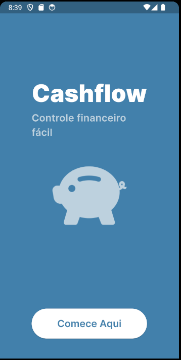
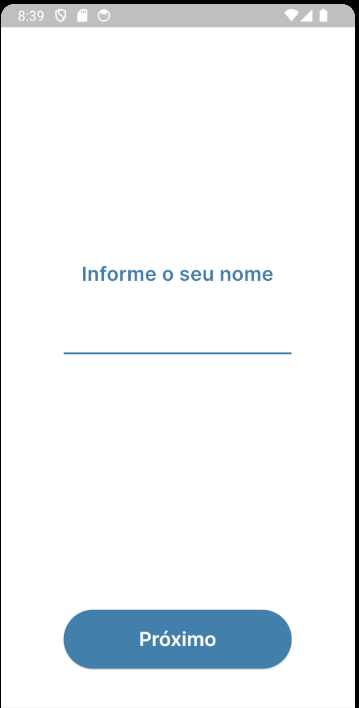
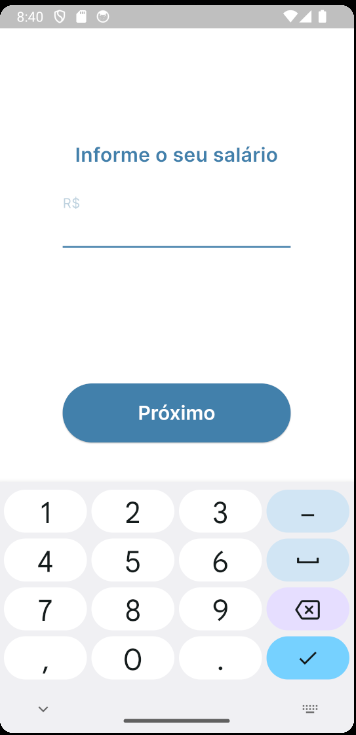
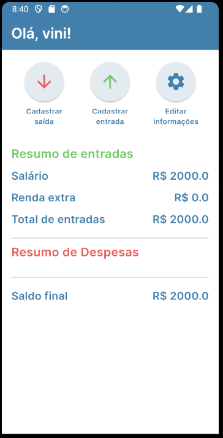

# CashFlow

Um projeto flutter desenvolvido por Vinicius Fernandes Carvalho e Gabriel Wendorff, alunos do 4° semestre de engenharia de software da Católica SC.

O projeto CashFlow é um aplicativo de controle financeiro seguindo a premissa feita para a N1 da matéria de desenvolvimento mobile.

## Escopo
App de Controle de Gastos
Objetivo: O usuário pode registrar suas despesas diárias, categorizá-las e visualizar relatórios de gastos por categoria.

## Algumas das dicas feitas pela professora para ajudar no desenvolvimento:

-  Widgets: Text, ListView, DropdownButton, Card.
-  Stateful Widget: Para adicionar, editar e excluir despesas.
-  Stateless Widget: Para exibir a lista de despesas.
-  Scaffold: AppBar com título e navegação, FloatingActionButton para adicionar despesas.
-  List: Para exibir as despesas cadastradas.
-  Map: Para categorizar e armazenar despesas (ex: {'valor': 50.00, 'categoria': 'Alimentação'}).
-  Layout: Grid ou ListView para exibição dos gastos.
-  Estilização: Estilos diferentes para cada categoria de despesa.
-  Botões: Para adicionar despesas, visualizar relatórios.
-  Navegação: Tela principal de despesas, tela de detalhes da despesa e relatórios.

## Paleta de cores
Nossa paleta foi monocromática seguindo os tons de Azul indo até o branco:
1. 4180AB
2. 8AB3CF
3. BDD1DE
4. E4EBF0
5. FFFFFF

## Telas do projeto

| Tela inicial | Tela de input do nome |
|--------------|-----------------------|
|  |  |

| Tela de input do salário | Tela de resumo financeiro |
|--------------------------|----------------------------|
|  |  |

## Como importar o projeto

1. Clone o repositório:
   git clone https://github.com/usuario/repositorio.git

2. Navegue até a pasta do projeto:
   cd repositorio

3. Instale as dependências:
   flutter pub get

4. Execute o projeto:
   flutter run

### Requisitos:
Flutter SDK instalado

Um dispositivo Android/iOS ou emulador configurado

## Protótipo no Figma

O protótipo inicial do projeto pode ser visualizado no [Figma](https://www.figma.com/design/P47dZe5mxPOWFww57FTJGM/App-CashFlow?node-id=0-1&node-type=canvas&t=oYFQlI3Ayk2XymSc-0).

